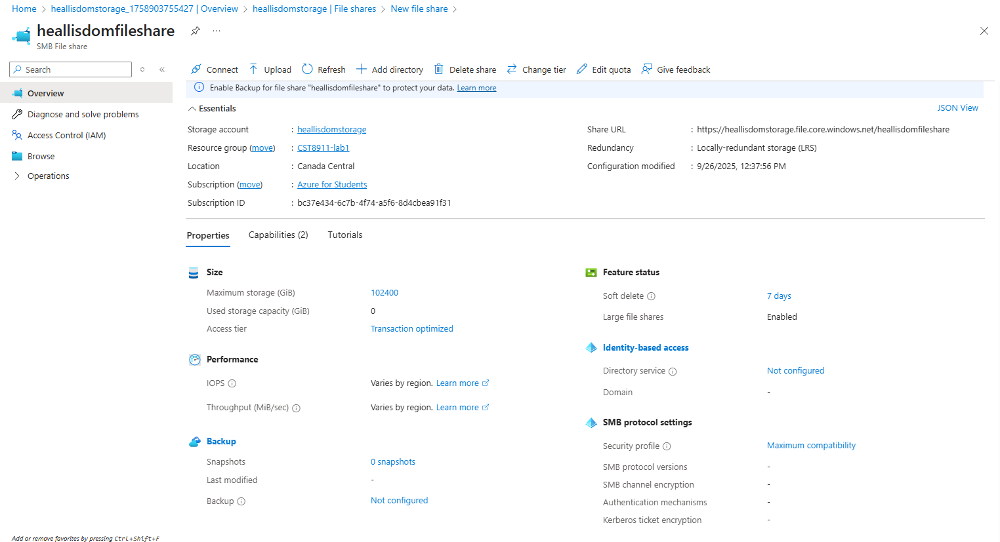
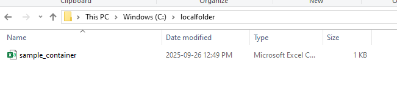
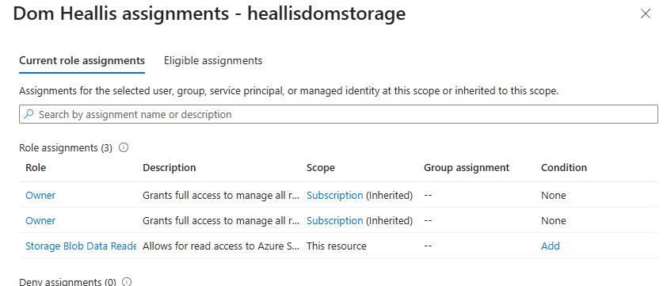

### Dom Heallis
### 040728287
### Lab 1
---

## 1. Create an Azure blob/Storage account for region US East and select local redundant storage
Got this error using US East

Used canada central instead

## 2. Add file named sample_container.csv objects to containers via GUI    

## 3. Create file share 

## 4. Work with objects in the containers, using AzCopy and download sample_container.csv file to a local folder, take screenshot of AzCopy commands and output - NO USE OF SAS TOKEN IN COMMAND 

had to give myself permissions

shows me contents of the container

downloaded successfully

here it is

## 5. Add file named sample_fc.json to file share using SAS token via command line, take screenshot of steps and output   

found token here

successful upload

browsed to find .json file uploaded

## 6. Check your current IAM policy for yourself   

   

## 7. Create IAM policy for storage account, that is relevant to the service that would allow you to view all resources, but does not allow you to make any changes.  

finding user

giving myself read only access

read only access (minus the inherited roles)

## 8. Delete everything

