# Dom Heallis - 040728287
# Lab 2

## Step 1 - Create storage account with Locally redundant storage setting and in the East US region  

Cannot use East Us, so ill use Canada Central
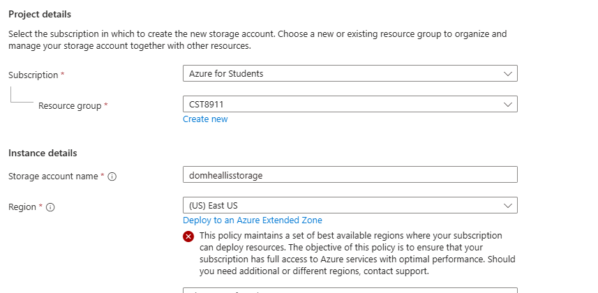

Created with locally-redundant storage
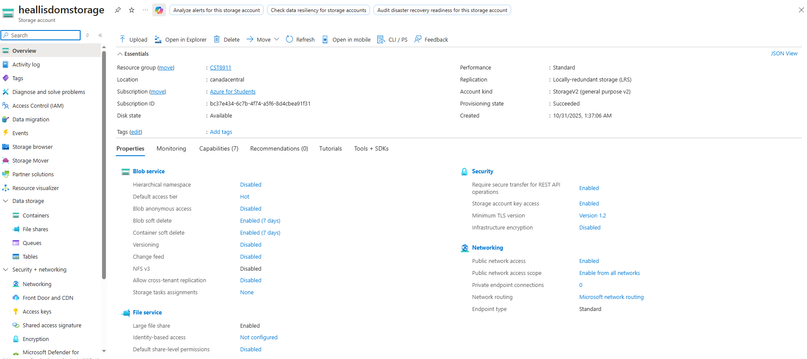

## Step 2

Chose consumption plan as you can see at the top, runtime stack is python, and region Canada Central because US east wasn't available (see picture from step 1)
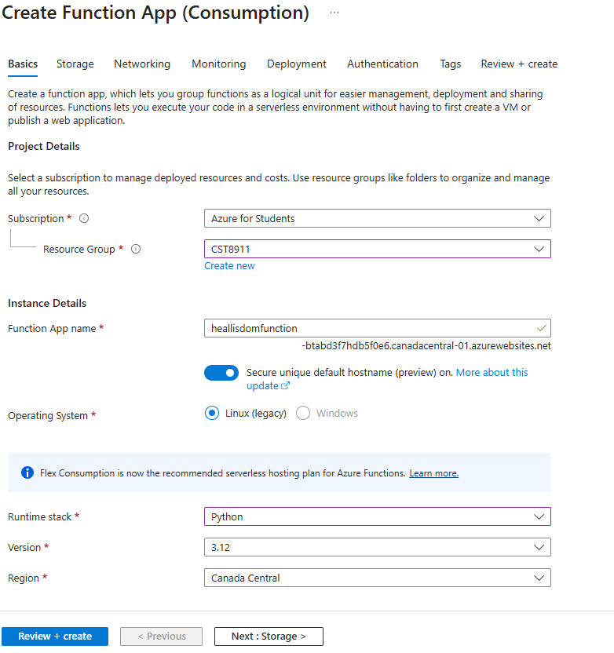

confirmation screen
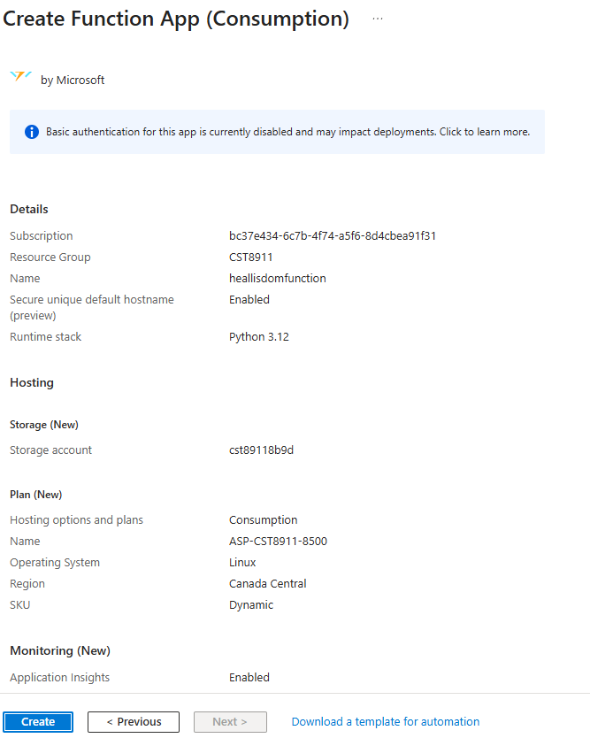

successfully create
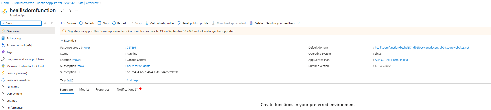

## Step 3

selecting blob trigger
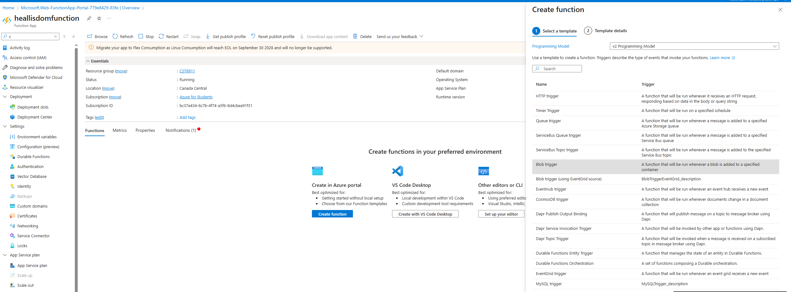

Using the storage account i created / also changed blobname later to heallisdomcontainer
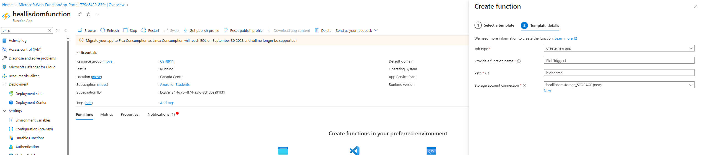

successfully created
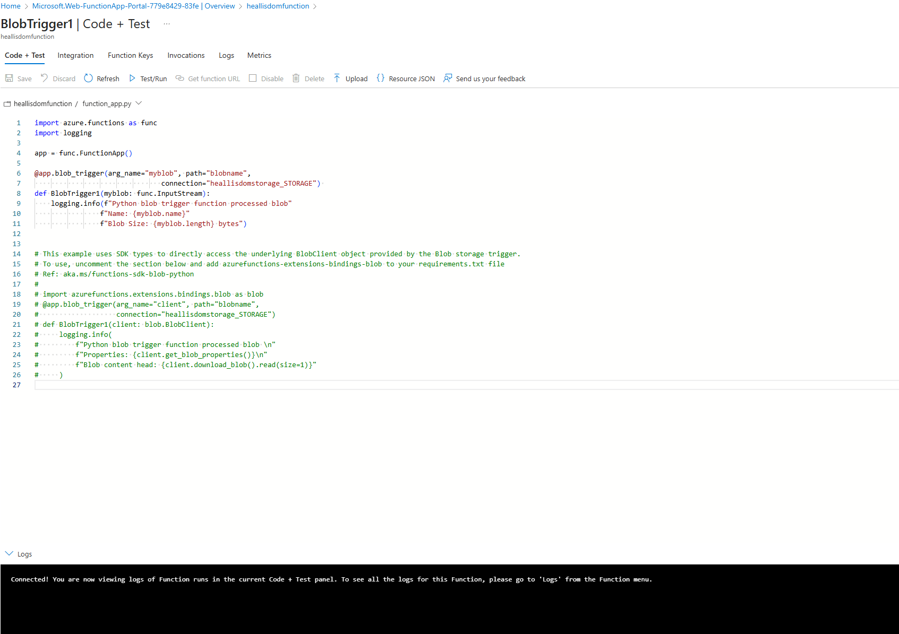

## Step 4

Screenshot of the code of the function
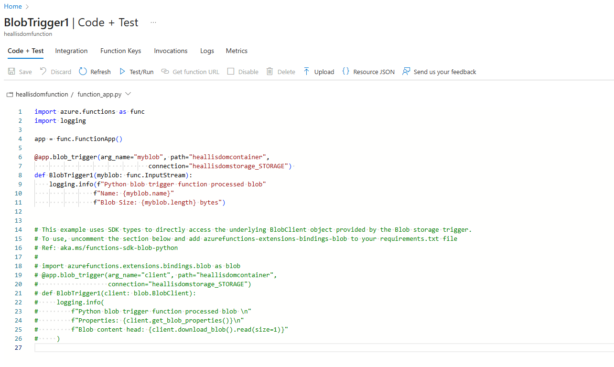

Screenshot of the .json file
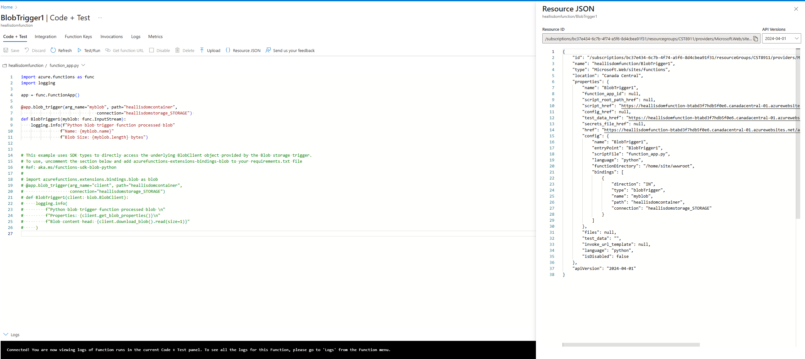
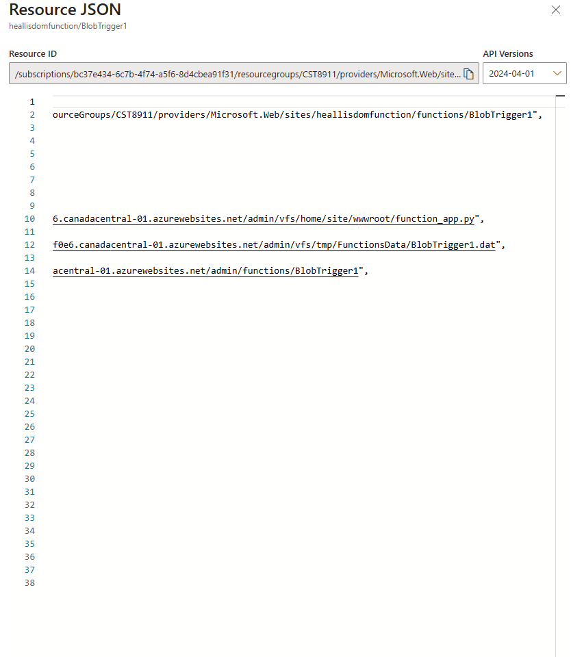

Screenshot of the Test/run Input file 
*uploading lecture 3 to test
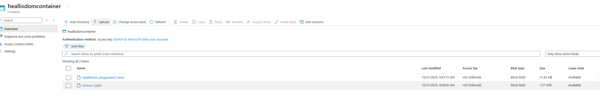
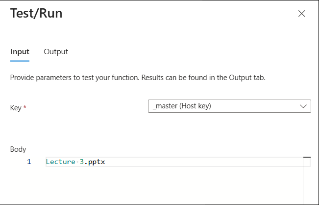
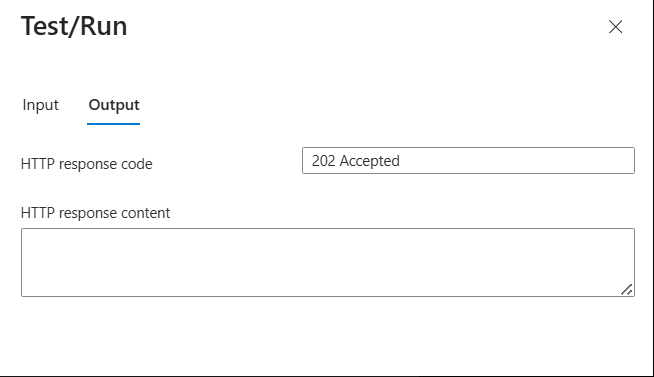

Screenshot of the output
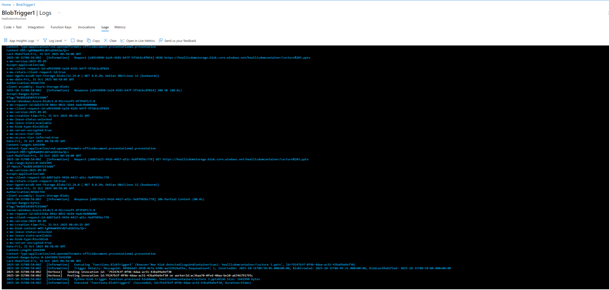

Deleting everything
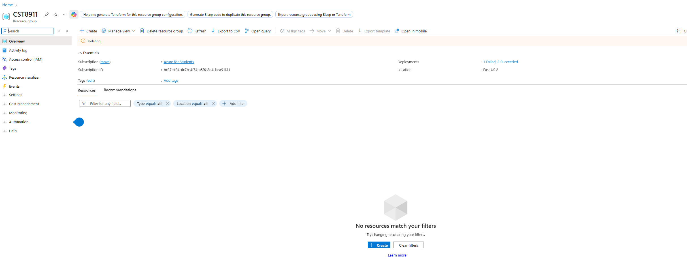
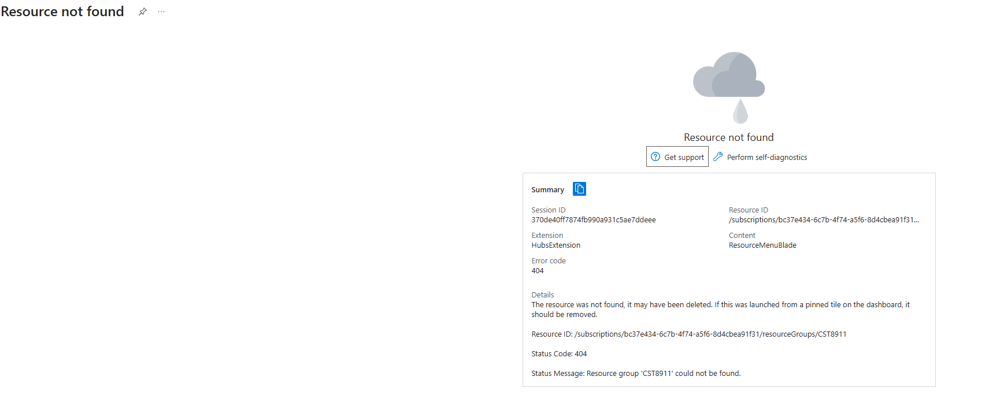
