# Dom Heallis - 040728287
# Lab 4

# Task 1 - Automation fails to deploy so ill do the 2nd lab instead

tried canada central, passed first validations but fails to deploy cause of subscription
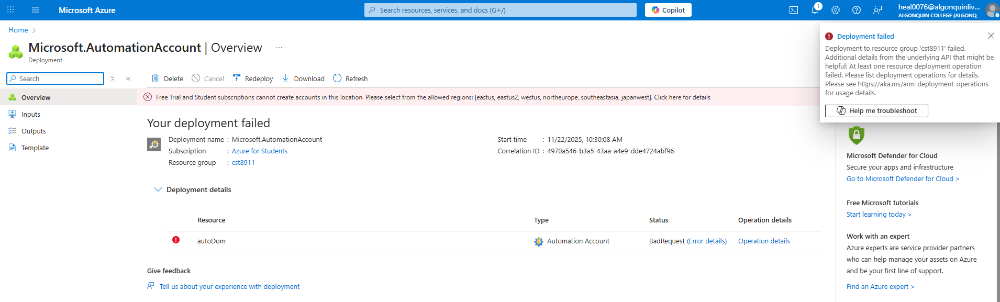

Trying other regions doesn't allow me past the first check
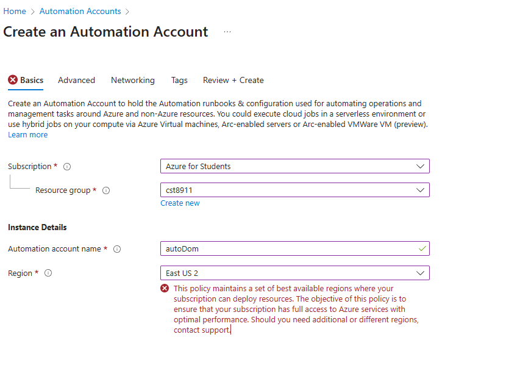

# Task 1 - Screenshot of html file content in repo and all other files, provide link but make sure I have access

on github
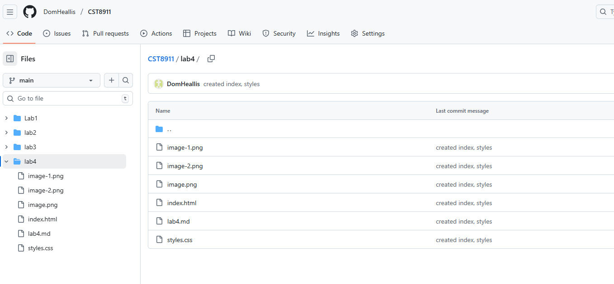

public repo
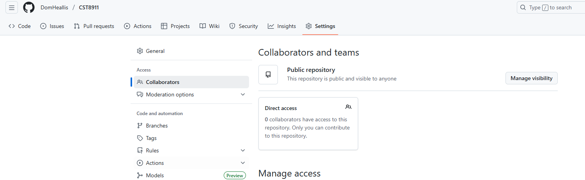

# Task 2 - Screenshot must show the process of creating static web app, show that free plan was selected and that github account was linked and repo name selected

creating static web app 
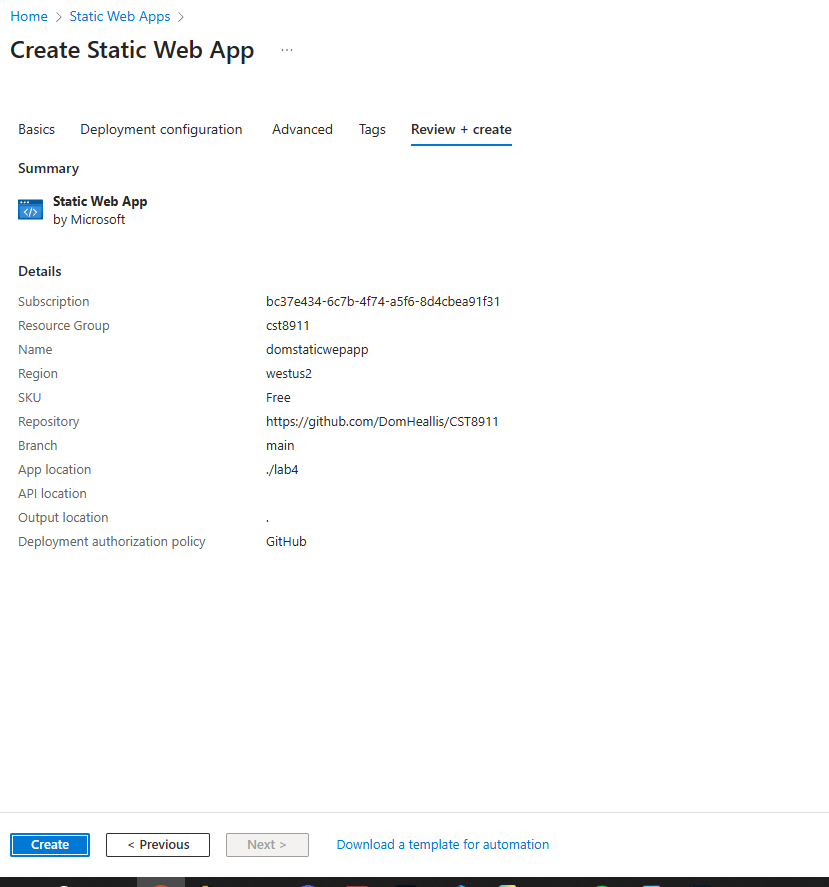

deployment successful

# Task 3 - Screenshot should show that workflow folder was added to repo and content of .yml file

Screenshot of workflow folder
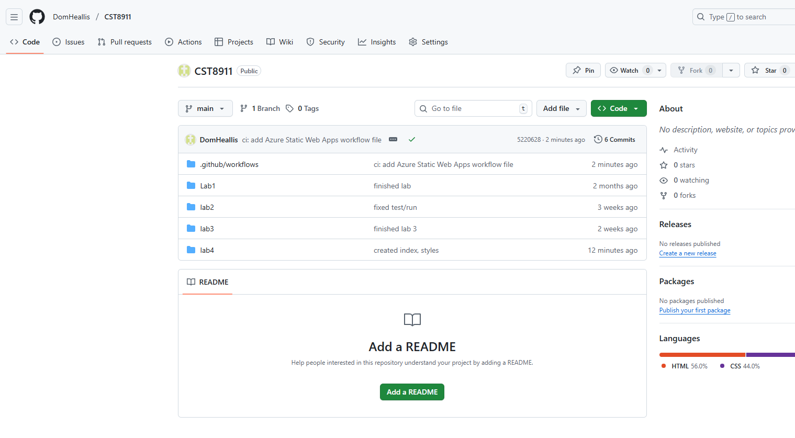

Contents of .yml file part 1
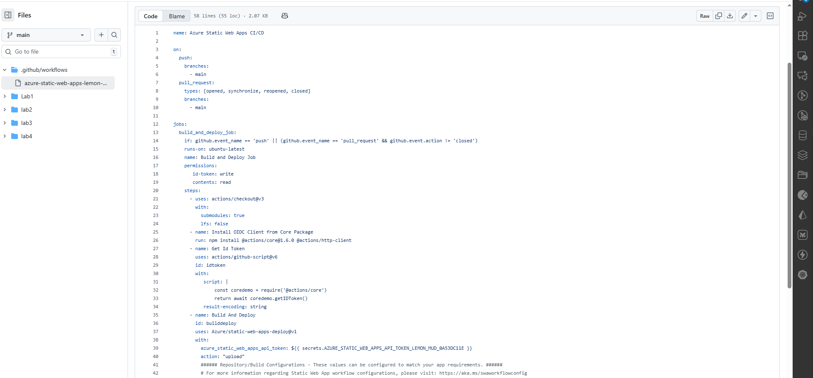

part 2
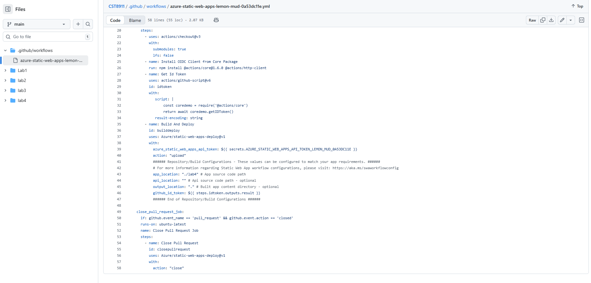

# Task 4 - Screenshot of the  site

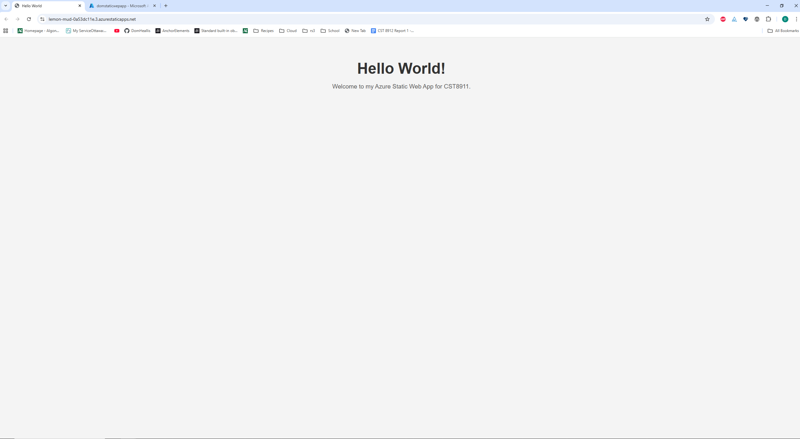

# Task 5 - Updating site

Updated html
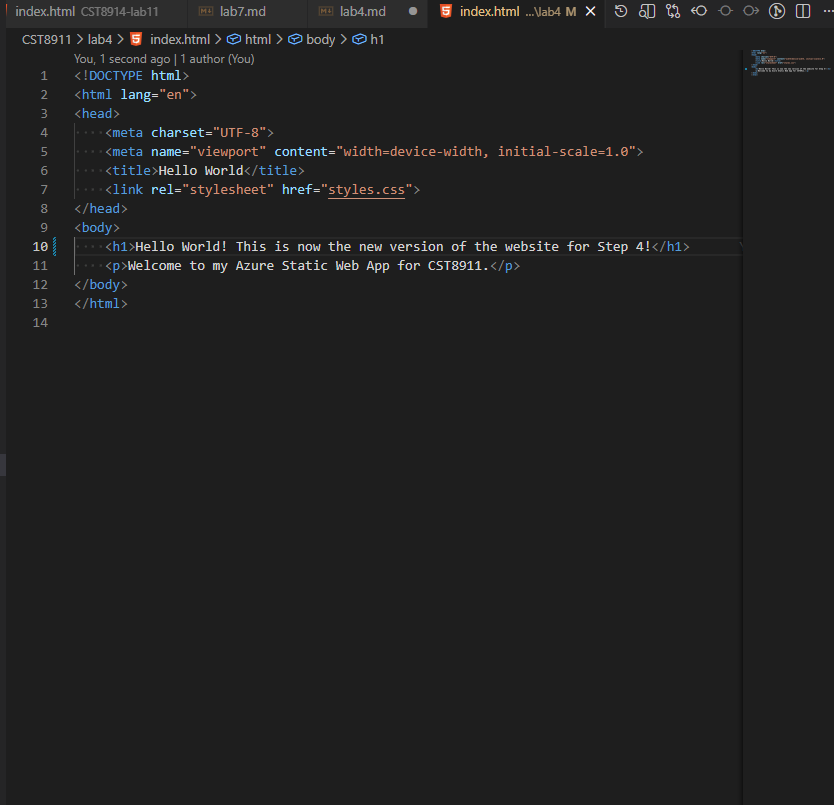

# step 6 - Updated web site

site is updating
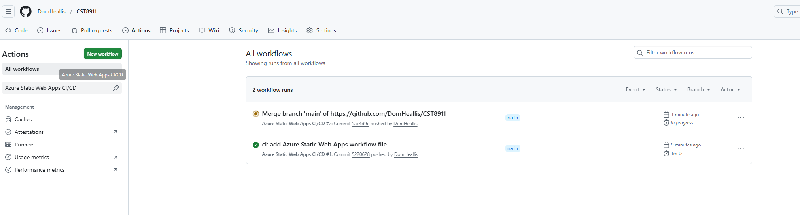

Update complete
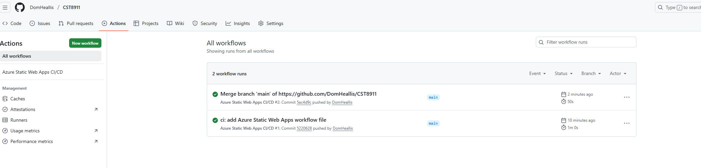

new site
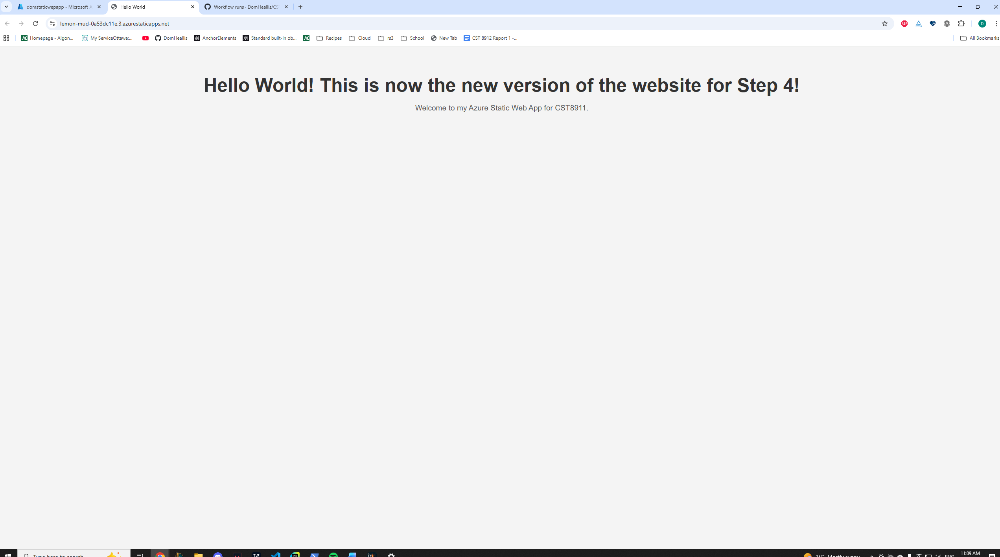

# Step 7 - Delete everything

static web app deleted
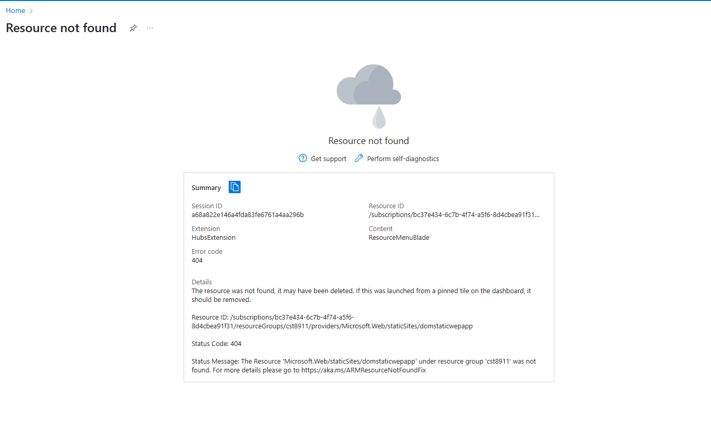

resource group deleted
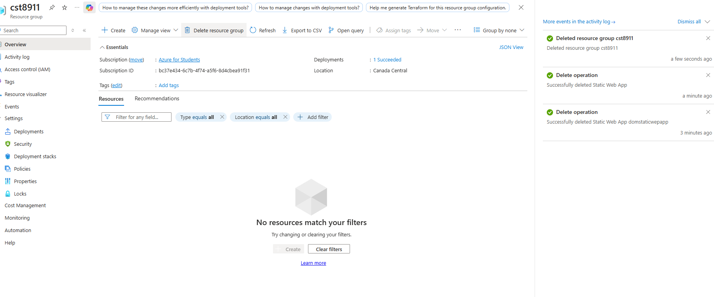